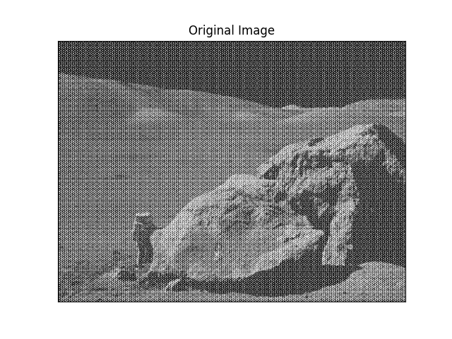
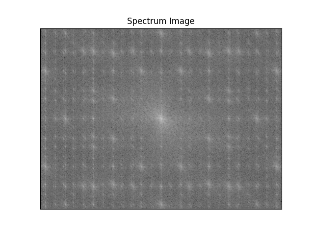
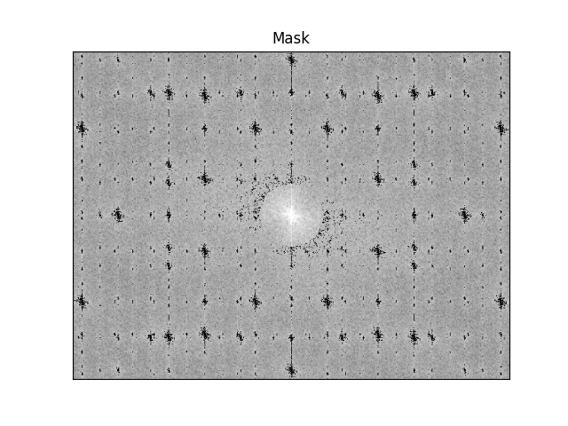
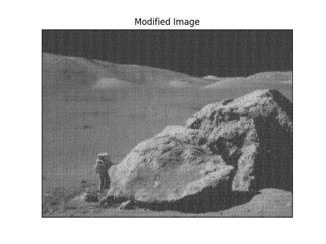

# Noise Reduction Using Fourier Transform
Implementating Case Specific Noise Reduction using Discrete Fourier Transform (DFT).


![](https://img.shields.io/badge/Matplotlib-v5.4-%236610f2?style=for-the-badge&logo=data:image/png;base64,iVBORw0KGgoAAAANSUhEUgAAABAAAAAQCAMAAAAoLQ9TAAAB2lBMVEUAAAD///////////////////+xs7Pl6OiHh4eOjo7s7Oz09PScnJympqatra27u7vOzs7BwcHCwsLHx8fn5+e6urvIyMicnJyxsbHX2NnAwMDJycnCwsKxs7O6urq7u7vJycmsrKxIZatUa6Vue2BxbGd0va55i3Z5jsWXcU6Y2pacrpagoKCoqKiq2Kivr6+wdU6wttGxu7Gzvb2z1rK0uaC4sLO5ubm72Lu8t7W8uLe8yLy9vMC9wMHA0YvBwcHCrqXCz7HDw8PEq6DEyczEzaLF3U7Iz9HI2MvI41vLx8XLycjLy8vMuHvMy9DMzMzOs0HO0cnP1dfQgUTQkGvRs6fSjmLSvG/S1dbTwbnT09PUfgDU0MfU0tHV1dXV19jV4NTWuQDWycTW1tbY2N7Z2dnZ2drc3Nzc3d3c3uDdyKbd3d3ekVje3t7e4OXfikTfy4Xf4OHg4eDg4ePhwEHh4ODh4eHjxD/j4+Pk5OTp6+7qkUrq7PLr6+3r7fPs7Ozt7e3u7e7u7u7v7+/v8/byk0Hz8/b08/H1jyb19fX41Ef4+Pj4+Pn5+fn61kP7kh77+Pv7+/v7+/z8/Pz9/f39/v79///+/v7/oFb/o1n/pmX/3mD/3mb///+K1by6AAAAInRSTlMAAChERmKjpaapq62vtL2+vr+/v8fP0N/f4urs7e/w9PT9ASJnrgAAAPZJREFUeNocjgNTBHAcBX+nbNu2zclNtm27iadsXG6/a/9u9N7uaEVEo9E4BkenhTqrI3Z2qJ0axALtrsoo9lhY+ep+NwGvQcpoXO4G+r6PumY7617mbr2UaIGG9c/Ri4qmtg+m9eLEyOZh+XnvTH3ZHuAuYXTctC4W9FTnc22FEMk83f/9edhIjsuOZfXZVinpa5M7/UupifFJMZdDJmuhRLB9fJaQO9GYNf5mhEhxA3a3yCs6GS4GvEU7BsvLTykZlFzVcKATjSezNsylOWaqHpsDVJgm8P6/2gz8zVsW4hmRdKAA0HMVojDvsggrOJkrCLGC+AA9MlD6ac5sNAAAAABJRU5ErkJggg==)


## Table of contents
* [Introduction](#introduction)
* [Approach](#approach)
* [Technologies](#technologies)
* [Setup](#setup)
* [Launch](#launch)
* [Illustrations](#illustrations)
* [Status](#status)
* [Sources](#sources)
* [Other](#other)


## Introduction
General method to remove Periodic Noise is by using different type of filters. This technique is generally called **Periodoc Noise Reduction by Frequency Domain Filtering**. Different filters that can be used to remove periodic noise are 
- Bandreject Filter 
- Bandpass Filter
- Notch Filter and many more.
If Noise is periodic, we can simply use any of the above filters to minimize noise content in the image.
If noise is not periodic than manually we need to remove noise. Important note here is that first we have to change Spatial Domain into frequency Domain, to apply filter.


## Approach
- To change spatial domain into frequency domain first we apply **Discrete Fourier Transform (DFT)** on the image.
- Now we are able to see spectrum of the image.
- We can see that there is not a pattern here that we can follow to remove noise.
- We just create a mask of spectrum image in such a way that central light burst is there. Others are blacked out.
- We adjust radius of central burst that is needed to be left out.
- We than multiply mask and DFT (Discrete Fourier Transform)
- We apply **IDFT (Inverse Discrete Fourier Transform)** to obtain modified Image


## Technologies
  #### Software Used :
  * VS Code : 1.58.2
  #### Languages Used :
  * Python 3
  #### OS used :
  * Ubuntu 20.04.3 LTS 64-bit


## Setup
First you must have these libraries and languages installed on your system -
  * [Python 3](https://www.python.org/)
  * [OpenCV](https://opencv.org/)


## Launch
To run the code, run this commands in terminal with main.py as in current directory and images in Images folder along with main.py
```
$ python3 main.py
```
Windows will pop-up with resultant images. (Press **X** to view next image).


## Illustrations
### Step By Step Image Transformation For Noise Reduction
<p align="center">
  
  
</p>
<p align="center">
  
  
</p>


## Project status
  ***Completed***


## Sources
  * Images used in this project may be subject to copyright.
  * [Digital Image Processing (Third Edition) by Rafael C. Gonzalez and Richard E. Woods](https://www.amazon.com/Digital-Image-Processing-Rafael-Gonzalez/dp/013168728X)
  * [OpenCV Documentation](https://docs.opencv.org/2.4/opencv_tutorials.pdf)
  
  
## Other
  This code was contributed by Abhinav Sharma.
